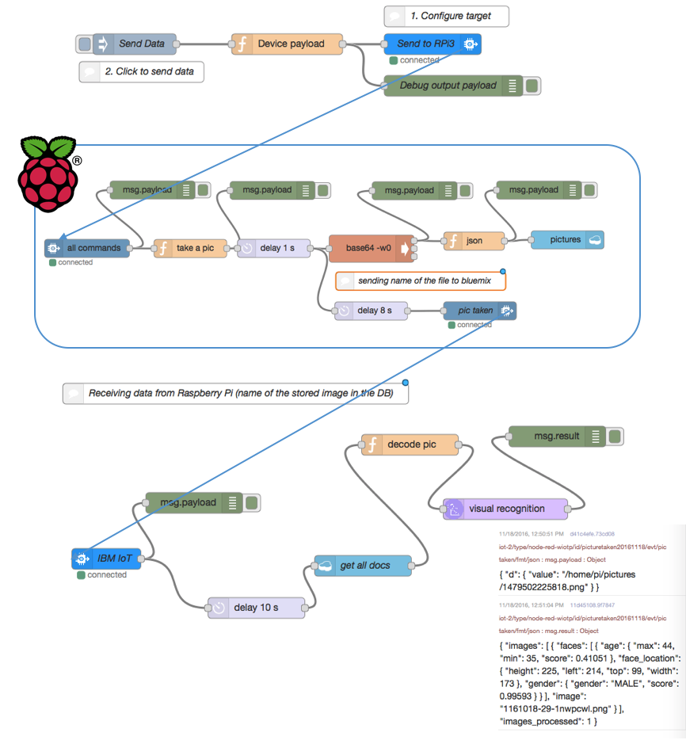

## Overview
In this lab you will expand the LAB1 functionality into 2-way communications between IBM Bluemix and a Raspberry Pi, again through the Node Red environment. 
Optionally we will add an camera (RaspCam) to Raspberry Pi to take pictures and analyze them. These pictures can then be sent to the Cloudant NoSQL Database hosted on the IBM Bluemix cloud. 
Then the images can be analyzed with the Watson Visual Analysis service.  
If a person is found in the picture we could drill down further to obtain their gender and approximate age. This information can then be sent to selected smartphones via the Twilio service.
For the communications between the Raspberry Pi and Bluemix we will use the Internet of Things Platform https://console.ng.bluemix.net/catalog/services/internet-of-things-platform

To create the application in this lab, follow these main steps:

1.	In the Watson IoT platform you would create a new device type and a new device.
2.	Using the default flow you would send a command to Raspberry Pi
3.	(optional) You would add a camera to Raspberry Pi (RaspCam)
4.	You would load an image to Cloudant NoSQL DB
5. 	You would pass the information to Bluemix on the name of the image for the Watson Visual Analysis
6. 	(optional) You would send a text message to your mobile phone thru Twilio API service

This is the chart describing what is the flow of the actions (Bluemix -> Raspberry Pi -> Bluemix/Watson).

## Prerequisites 
You need the following software:

-	finished LAB1
-	(optional) RaspCam - the accessory camera for Raspberry Pi
-	(optional) Twilio account

## Next steps
Please follow [LAB 3](https://github.com/blumareks/iot-watson-swift/tree/master/lab3).

@blumareks, http://blumareks.blogpost.com
